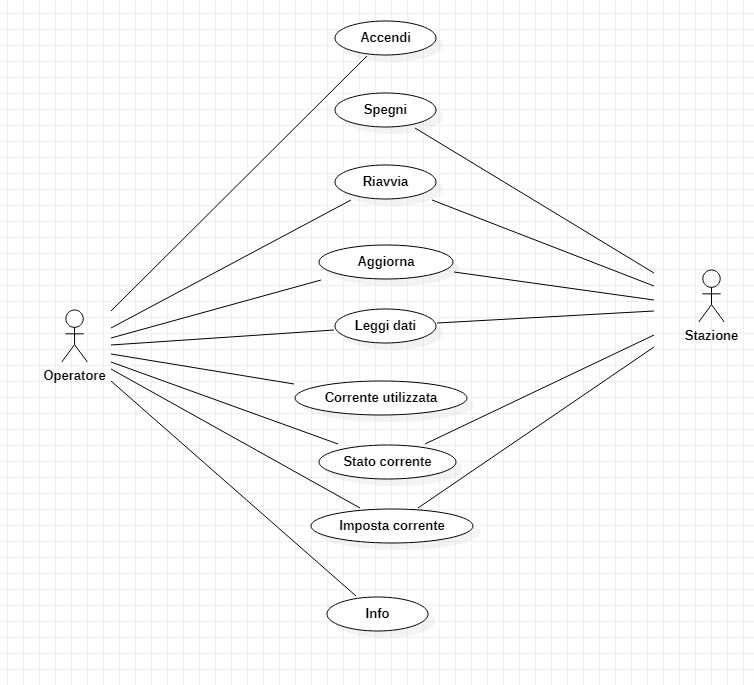
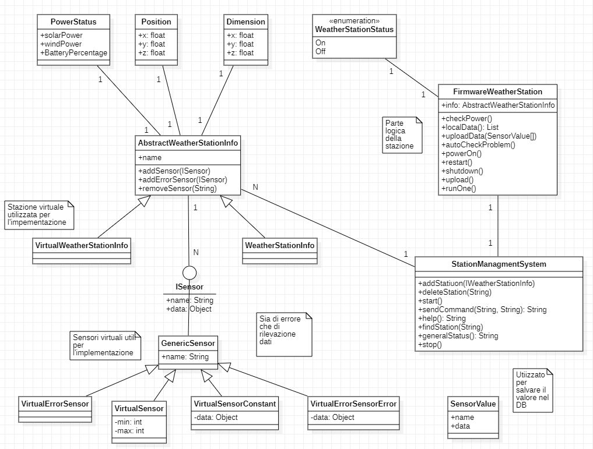
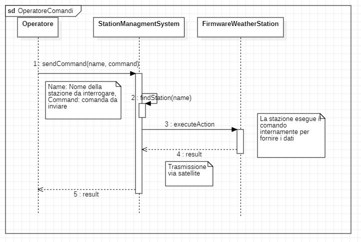
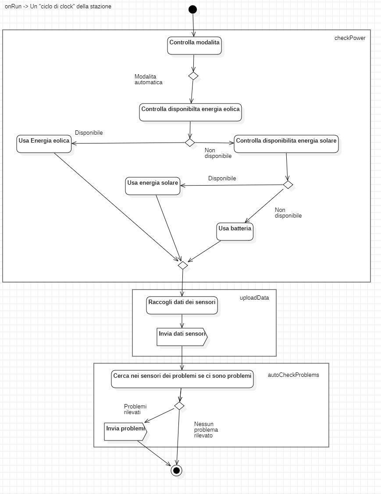

# Wilderness weather station

## Introduzione
**Wilderness weather station** è un sistema per il monitoraggio delle informazioni atmosferiche in aree remote,
dove non è possibile un'installazione delle normali attrezzature di monitoraggio.

Le caratteristiche di queste stazione sparse per il territorio è la funzionalità di utilizzare fonti di energia
rinnovabile (come Pale eoliche e Luce solare). Nel caso in cui una delle due non dovrebbe essere sufficiente all'alimentazione, la stazione utilizzerà la batterie (che in situazione normale vengo ricaricate con l'eccesso di energia). Un altro problema che devono anche sapersi autogestirsi nel caso in cui la connessione
satellitare con il sistema centrale venga a mancare.

Componenti di questo sistema sono i seguenti:
- **The Weather Station System**, che si occupa di prelevare i dati dalle varie stazioni e di eseguire del pre-processing se necessario
- **The Data Management and Archiving System**, si occupa dell'archiviazione, elaborazione, trasformazione delle informazioni ottenute dalle varie stazioni
- **The Station Management System**, questo componente comunica con le varie stazione per monitorare la salute, eseguire gli aggiornamenti e permettere anche il controllo remoto di quest'utlime a un operatore

## Progetto

I file e cartelle sono organizzate nel seguente modo:
- **doc**, che contiene la documentazione del progetto (che contiene le immagini e i file di progetto di StarUML).
- **src**, che contiene i file sorgenti

In questo progetto è stata sviluppata il componente **The Station Managment System**.

Inoltre è stato integrato un file di simulazione che permette di ottenere una simulazione del funzionamento con stazioni virtuali e sensori anch'essi virtuali.

## Scenari
Gli scenari presi in considerazione sono i seguenti riportati qui sotto.

### Comunicazione dati (testCommunicationData)
L'operatore comunica con la macchina tramite satellite grazie al Station Managment System. La stazione deve rispondere alla richiesta dei dati attualmente ancora da inviare al sistema di gestione dei dati.

### Comunicazione corrente (testCommunicationPower)
L'operatore comunica con la macchina tramite satellite grazie al Station Managment System. La stazione deve spegnersi/aggiornarsi/riavviarsi/accendersi correttamente secondo le richieste dell'operatore.

### Comunicazione dello stato corrente della stazione (testCommincationStatus)
L'operatore comunica con la macchina tramite satellite grazie al Station Managment System. La stazione deve rispondere al'operatore con l'attuale sistuazione energetica (quindi batteria, potenza del vento e pannelli solari).

### Cambio stato della connessione (testConnectionChanged)
La stazione deve passare automaticamente allo stato automatico quando perde la connessione con la centrale. Per evitare che la macchina si spegni inaspettatamente perchè non ha cambiato l'alimentazione.

### Connessione mancante dati sensori (testDataConnectionLost)
La stazione deve salvare i dati dei sensori internamente fino a quando verrà ripristinata la connessione satellitare, per poi inviarli in blocco quando rientrerà in contatto con la centrale.

### Sensori di errore (testErrorSensor)
La stazione deve saper prendere i valori dei vari sensori di errore. Gli errori sono gestiti tramite dei sensori che mostrano un messaggio, se non viene visualizzato nessun messaggio non c'è stato nessun errore rilevato da quel sensore, viceversa verrà visualizzato l'errore.

### Gestione della corrente (testPower)
Ogni stazione dev'essere in grado di gestire la sua energia disponibile, utilizzando la fonte appropriata in base alla disponibilità di quel momento preciso.
Quindi ad esempio sceglierà di utilizzare le pale eoliche di giorno per permettere alla batteria di ricaricarsi grazie ai pannelli solari.

### Salvataggio dei dati (testSaveData)
La stazione deve inviare i dati alla centrale. Quando la stazione è connessa correttamente alla centrale, invia un pacco di dati ogni tot con i dati dei differenti sensori.

### Sensori (testSensor)
La stazione deve poter leggere i vari sensori di cui dispone. Questa è la funzionalita principale della stazione, rilevare i differenti valori ambientali (come velocita del vento, temperatura, ...) dai suoi sensori installati a bordo.

## Design
Nelle successive sezioni si mostra la documentazione seguita per la progettazione del progetto.

### Use case diagram

### Class diagrams

### Sequence diagrams

### Activity diagram

## Testing

Il codice è stato testato con JUnit ed è stata ottenuta una coverage del 100%.
Inoltre sono stati effettuati degli Acceptance Test per ogni scenario presentato qui sopra.
